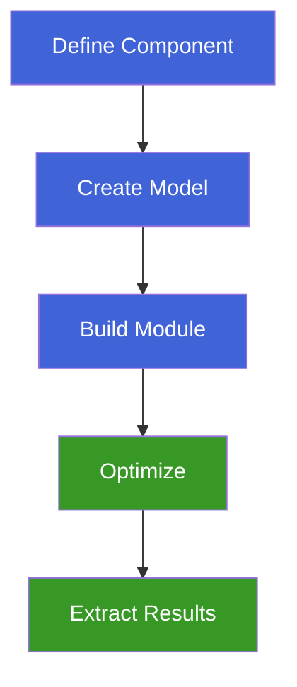

# Quick Start

Let's solve your first optimization problem with Amigo! This guide will walk you through creating, building, and solving a simple optimization problem.

## The Rosenbrock Problem

The Rosenbrock function is a classic test problem in optimization. We'll minimize it subject to a circular constraint.

### Step 1: Import Amigo

```python
import amigo as am
```

### Step 2: Define a Component

Create a component by inheriting from `am.Component`:

```python
class Rosenbrock(am.Component):
    def __init__(self):
        super().__init__()
        
        # Define inputs (design variables)
        self.add_input("x1", value=-1.0, lower=-2.0, upper=2.0)
        self.add_input("x2", value=-1.0, lower=-2.0, upper=2.0)
        
        # Define objective
        self.add_objective("obj")
        
        # Define constraint
        self.add_constraint("con", value=0.0, lower=-float("inf"), upper=0.0)
    
    def compute(self):
        # Extract inputs
        x1 = self.inputs["x1"]
        x2 = self.inputs["x2"]
        
        # Compute objective (Rosenbrock function)
        self.objective["obj"] = (1 - x1) ** 2 + 100 * (x2 - x1**2) ** 2
        
        # Compute constraint (x1² + x2² ≤ 1)
        self.constraints["con"] = x1**2 + x2**2 - 1.0
```

### Step 3: Create and Build Model

```python
# Create model
model = am.Model("rosenbrock")

# Add component (name, number of instances, component object)
model.add_component("rosenbrock", 1, Rosenbrock())

# Build C++ module (compiles the code)
model.build_module()

# Initialize the model
model.initialize()
```

:::tip
When you modify your `compute()` method, you must call `model.build_module()` again to recompile the C++ code.
:::

### Step 4: Optimize

```python
# Create optimizer
opt = am.Optimizer(model)

# Run optimization
opt.optimize()

# Print results
print(f"Optimal x1: {model.get_input('rosenbrock.x1')}")
print(f"Optimal x2: {model.get_input('rosenbrock.x2')}")
print(f"Optimal objective: {model.get_objective('rosenbrock.obj')}")
```

## Complete Script

Here's the complete working example:

```python
import amigo as am

class Rosenbrock(am.Component):
    def __init__(self):
        super().__init__()
        self.add_input("x1", value=-1.0, lower=-2.0, upper=2.0)
        self.add_input("x2", value=-1.0, lower=-2.0, upper=2.0)
        self.add_objective("obj")
        self.add_constraint("con", value=0.0, lower=-float("inf"), upper=0.0)
    
    def compute(self):
        x1 = self.inputs["x1"]
        x2 = self.inputs["x2"]
        self.objective["obj"] = (1 - x1) ** 2 + 100 * (x2 - x1**2) ** 2
        self.constraints["con"] = x1**2 + x2**2 - 1.0

# Create and configure model
model = am.Model("rosenbrock")
model.add_component("rosenbrock", 1, Rosenbrock())
model.build_module()
model.initialize()

# Optimize
opt = am.Optimizer(model)
opt.optimize()

# Display results
print(f"Optimal x1: {model.get_input('rosenbrock.x1'):.6f}")
print(f"Optimal x2: {model.get_input('rosenbrock.x2'):.6f}")
print(f"Optimal objective: {model.get_objective('rosenbrock.obj'):.6f}")
```

## Understanding the Workflow

The Amigo workflow consists of four key steps:



1. **Define Component**: Create classes with inputs, outputs, constraints, and objectives
2. **Create Model**: Add components and define variable linking
3. **Build Module**: Compile Python code to optimized C++
4. **Optimize**: Solve the problem using gradient-based optimization

## Key Concepts

### Inputs
Design variables that the optimizer can modify:
```python
self.add_input("x", value=0.0, lower=-10.0, upper=10.0)
```

### Outputs
Computed quantities that can be linked to other components:
```python
self.add_output("y")
```

### Objectives
Functions to minimize (or maximize with negative sign):
```python
self.add_objective("f")
```

### Constraints
Equality or inequality constraints:
```python
# Inequality: lower ≤ constraint ≤ upper
self.add_constraint("g", lower=0.0, upper=float("inf"))

# Equality: constraint = value
self.add_constraint("h", value=0.0, lower=0.0, upper=0.0)
```

## Next Steps

Now that you've solved your first problem, explore more:

- [Cart Pole Tutorial](../tutorials/cart-pole.md) - Comprehensive optimal control example
- [API Reference](../api/overview.md) - Complete API documentation

:::info
Ready for more complex problems? Check out our [Tutorials](../tutorials/intro.md) section!
:::

