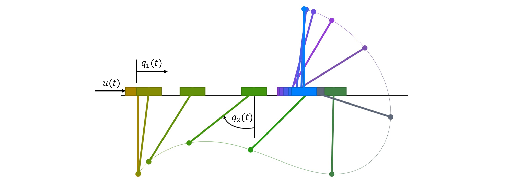

# Cart-Pole Problem

For this example, we consider the well-known cart-pole problem, also called the inverted pendulum on a cart. The system consists of a cart that can move horizontally along a frictionless track, with a pole attached to it by a frictionless hinge. The state variables are $(q_1, q_2, \dot{q}_1, \dot{q}_2)$ where $q_1$ is the cart position, $q_2$ is the pole angle from vertical downward, and $\dot{q}_1$, $\dot{q}_2$ are the corresponding velocities, for a total state dimension of 4. The system is controlled by a horizontal force $x$ applied to the cart and is subject to gravity $g$. The objective is to swing the pole from hanging downward to the upright balanced position while minimizing control effort.

<div align="center">



**Figure 1.** Cart-pole desired trajectory.

</div>

<br/>

We thus want to solve the optimal control problem in Bolza form

$$
\min \int_0^{t_f} \frac{1}{2} x(t)^2 \, \mathrm{d}t
$$

subject to the controlled dynamics. The equations of motion are derived from Lagrangian mechanics and can be written in matrix form as:

$$
\begin{bmatrix}
m_1 + m_2 & m_2 L \cos q_2 \\
m_2 L \cos q_2 & m_2 L^2
\end{bmatrix}
\begin{bmatrix}
\ddot{q}_1 \\
\ddot{q}_2
\end{bmatrix}
=
\begin{bmatrix}
x + m_2 L \sin q_2 \cdot \dot{q}_2^2 \\
-m_2 g L \sin q_2
\end{bmatrix}
$$

The velocities are denoted as $\dot{q}_1$ (cart velocity) and $\dot{q}_2$ (pole angular velocity). Converting to a first-order ODE system, the kinematic equations are:

$$
\dot{q}_1 = \dot{q}_1, \quad \dot{q}_2 = \dot{q}_2
$$

The dynamic equations are obtained by inverting the mass matrix:

$$
\begin{bmatrix}
\ddot{q}_1 \\
\ddot{q}_2
\end{bmatrix}
=
\frac{1}{m_1 + m_2 \sin^2 q_2}
\begin{bmatrix}
1 & -\cos q_2 \\
-\frac{\cos q_2}{L} & \frac{m_1 + m_2}{m_2 L^2}
\end{bmatrix}
\begin{bmatrix}
x + m_2 L \sin q_2 \cdot \dot{q}_2^2 \\
-m_2 g L \sin q_2
\end{bmatrix}
$$

which expands to:

$$
\ddot{q}_1 = \frac{x + m_2 L \sin q_2 \cdot \dot{q}_2^2 + m_2 g \cos q_2 \sin q_2}{m_1 + m_2 \sin^2 q_2}
$$


$$
\quad \ddot{q}_2 = \frac{-x \cos q_2 - m_2 L \cos q_2 \sin q_2 \cdot \dot{q}_2^2 - (m_1 + m_2) g \sin q_2}{L(m_1 + m_2 \sin^2 q_2)}
$$

The initial state variables are all zeros for $t_0 = 0$. The final state is prescribed to be the upright position at cart location 2:

$$
\begin{aligned}
q_1(t_f) &= 2 \\
q_2(t_f) &= \pi \\
\dot{q}_1(t_f) &= 0 \\
\dot{q}_2(t_f) &= 0
\end{aligned}
$$


We import the necessary Python packages:

```python
import amigo as am
import numpy as np
import matplotlib.pyplot as plt
```

## Problem setup

We begin by defining the time discretization and physical parameters:

```python
# Time discretization
final_time = 2.0        # final time [s]
num_time_steps = 100    # number of discretization steps

# Physical parameters
m1 = 1.0   # cart mass [kg]
m2 = 0.3   # pole mass [kg]  
L = 0.5    # pole length [m]
g = 9.81   # gravity [m/s²]
```

The problem is discretized into a finite number of time steps. For each time interval, we create state variables at the grid points and enforce the dynamics through collocation constraints.

## Direct Method

We solve the problem using Amigo's direct transcription approach. The key idea is to discretize the continuous-time problem into a finite-dimensional nonlinear programming (NLP) problem by representing the state and control trajectories at discrete time points.

### Component 1: Cart Dynamics

The `CartComponent` encapsulates the system dynamics. In Amigo, all analysis occurs within classes derived from `amigo.Component`.

```python
import amigo as am

class CartComponent(am.Component):
    def __init__(self):
        super().__init__()
        
        # Physical constants (compile-time values)
        self.add_constant("g", value=9.81)    # gravity [m/s²]
        
        # Data (can be changed between solves without recompiling)
        self.add_data("L", value=0.5)         # pole length [m]
        self.add_data("m1", value=1.0)        # cart mass [kg]
        self.add_data("m2", value=0.3)        # pole mass [kg]
        
        # Inputs (design variables controlled by optimizer)
        self.add_input("x", label="control")      # control force
        self.add_input("q", shape=(4,), label="state")     # state vector
        self.add_input("qdot", shape=(4,), label="rate")   # state derivatives
        
        # Constraints (residuals that must equal zero)
        self.add_constraint("res", shape=(4,), label="residual")
    
    def compute(self):
        # Extract parameters
        g = self.constants["g"]
        L = self.data["L"]
        m1 = self.data["m1"]
        m2 = self.data["m2"]
        
        # Extract inputs (these are symbolic, not numeric)
        x = self.inputs["x"]          # control force
        q = self.inputs["q"]          # q = [q1, q2, q1dot, q2dot]
        qdot = self.inputs["qdot"]    # derivatives [q1dot, q2dot, q1ddot, q2ddot]
        
        # Compute intermediate variables (stored for AD)
        sint = self.vars["sint"] = am.sin(q[1])  # sin(q2)
        cost = self.vars["cost"] = am.cos(q[1])  # cos(q2)
        
        # Dynamics residual: res = 0 enforces the differential equations
        res = 4 * [None]
        
        # Kinematic constraints: q1dot - q2 = 0, q2dot - q3 = 0
        res[0] = q[2] - qdot[0]  # q1dot = q2
        res[1] = q[3] - qdot[1]  # q2dot = q3
        
        # Dynamic constraints (from inverted mass matrix)
        # Cart acceleration equation
        res[2] = ((m1 + m2*(1.0 - cost*cost))*qdot[2] 
                 - (L*m2*sint*q[3]*q[3]*x + m2*g*cost*sint))
        
        # Pole angular acceleration equation
        res[3] = (L*(m1 + m2*(1.0 - cost*cost))*qdot[3]
                 + (L*m2*cost*sint*q[3]*q[3] + x*cost + (m1 + m2)*g*sint))
        
        # Set the constraint (optimizer will drive res → 0)
        self.constraints["res"] = res
```

:::note

The `compute()` method operates on symbolic variables, not numeric values. When you write `am.sin(q[1])`, Amigo records this operation for automatic differentiation and C++ code generation.

:::

### Component 2: Time Integration

The `TrapezoidRule` component enforces trapezoidal collocation constraints for time integration. This provides second-order accuracy and implicit stability.

```python
class TrapezoidRule(am.Component):
    def __init__(self):
        super().__init__()
        
        # Time step as a constant
        self.add_constant("dt", value=final_time / num_time_steps)
        
        # State values at consecutive time points
        self.add_input("q1")      # State at time k
        self.add_input("q2")      # State at time k+1
        
        # State derivatives at consecutive time points
        self.add_input("q1dot")   # Rate at time k
        self.add_input("q2dot")   # Rate at time k+1
        
        # Integration constraint residual
        self.add_constraint("res")
    
    def compute(self):
        dt = self.constants["dt"]
        q1 = self.inputs["q1"]
        q2 = self.inputs["q2"]
        q1dot = self.inputs["q1dot"]
        q2dot = self.inputs["q2dot"]
        
        # Trapezoidal rule: q(k+1) = q(k) + dt/2 * (qdot(k) + qdot(k+1))
        # Rearranged as residual: q2 - q1 - dt/2*(q1dot + q2dot) = 0
        self.constraints["res"] = q2 - q1 - 0.5*dt*(q1dot + q2dot)
```

:::tip

The trapezoidal rule is an implicit method that evaluates the derivative at both endpoints. This provides better stability than explicit methods like forward Euler, especially for stiff systems.

:::

Since each state variable needs an integration constraint at each time interval, the total number of trapezoidal rule instances equals the number of state variables multiplied by the number of time intervals.

### Component 3: Initial Conditions

The initial conditions enforce that the system starts at the hanging equilibrium:

```python
class InitialConditions(am.Component):
    def __init__(self):
        super().__init__()
        
        # Link to state at t=0
        self.add_input("q", shape=(4,))
        
        # Constraint: all states must be zero initially
        self.add_constraint("res", shape=(4,))
    
    def compute(self):
        q = self.inputs["q"]
        
        # Enforce q(0) = [0, 0, 0, 0]
        # Each element of res will be constrained to equal zero
        self.constraints["res"] = [q[0], q[1], q[2], q[3]]
```

This component has only 1 instance and is linked to the state at the first time step.

### Component 4: Final Conditions

The final conditions specify the desired terminal state (pole upright, cart at position 2):

```python
class FinalConditions(am.Component):
    def __init__(self):
        super().__init__()
        
        self.add_constant("pi", value=np.pi)
        
        # Link to state at t=tf
        self.add_input("q", shape=(4,))
        
        # Terminal constraints
        self.add_constraint("res", shape=(4,))
    
    def compute(self):
        pi = self.constants["pi"]
        q = self.inputs["q"]
        
        # Enforce q(tf) = [2, π, 0, 0]
        # Cart at position 2, pole at angle π (upright), velocities zero
        self.constraints["res"] = [q[0] - 2.0,  # q1(tf) = 2
                                  q[1] - pi,     # q2(tf) = π
                                  q[2],          # q1dot(tf) = 0
                                  q[3]]          # q2dot(tf) = 0
```

### Component 5: Objective Function

The objective minimizes the integral of squared control force using trapezoidal approximation:

```python
class Objective(am.Component):
    def __init__(self):
        super().__init__()
        
        # Control values at consecutive time points
        self.add_input("x1", label="control")  # control at time k
        self.add_input("x2", label="control")  # control at time k+1
        
        # Objective function value
        self.add_objective("obj")
    
    def compute(self):
        x1 = self.inputs["x1"]
        x2 = self.inputs["x2"]
        
        # Trapezoidal approximation: ∫ x² dt ≈ Σ (x_k² + x_{k+1}²)/2 × dt
        # The dt factor and 1/2 from the objective are combined here
        self.objective["obj"] = (x1*x1 + x2*x2) / 2
```

When multiple components define objectives, Amigo automatically sums them. With 100 time intervals, we create 100 instances of this component, and the total objective becomes the sum of all local objectives, properly approximating the continuous integral.

## Model Assembly and Variable Linking

The components are assembled into a complete model by creating multiple instances and establishing variable linkages that define the optimization problem structure.

### Creating the Model

```python
# Create component instances
cart = CartComponent()
trap = TrapezoidRule()
obj = Objective()
ic = InitialConditions()
fc = FinalConditions()

# Create model with a unique name
model = am.Model("cart_pole")
```

### Adding Components with Multiple Instances

```python
# Add components with specified number of instances
model.add_component("cart", num_time_steps + 1, cart)   # 101 instances (states at each time point)
model.add_component("trap", 4 * num_time_steps, trap)   # 400 instances (4 states × 100 intervals)
model.add_component("obj", num_time_steps, obj)         # 100 instances (one per interval)
model.add_component("ic", 1, ic)                        # 1 instance (initial condition)
model.add_component("fc", 1, fc)                        # 1 instance (final condition)
```

**Understanding instance counts:**
- **cart**: `num_time_steps + 1` instances for states at all grid points (including initial and final)
- **trap**: `4 × num_time_steps` instances because each state variable needs integration constraints at each interval
- **obj**: `num_time_steps` instances to approximate the continuous integral cost
- **ic, fc**: Single instances for boundary conditions

### Variable Linking: Connecting Components

Variable linking connects components by establishing relationships between their variables using scoped references of the form `component.variable[indices]`.

**Linking semantics:**
- **Input-to-input links**: Create shared variables. When two inputs are linked, they reference the same memory location and any constraint on one affects the other. This enforces variable equality across components.
- **Output-to-output or constraint-to-constraint links**: Sum the values. Multiple components can contribute to a single quantity, enabling assembly of global outputs or distributed constraints.

#### Time Integration Links

The trapezoidal rule requires pairs of consecutive states. For each state variable, we link the cart states to the integration components:

```python
for i in range(4):  # Each state variable
    start = i * num_time_steps
    end = (i + 1) * num_time_steps
    
    # Link consecutive state pairs for integration
    model.link(f"cart.q[:{num_time_steps}, {i}]", f"trap.q1[{start}:{end}]")
    model.link(f"cart.q[1:, {i}]", f"trap.q2[{start}:{end}]")
    
    # Link corresponding derivatives
    model.link(f"cart.qdot[:-1, {i}]", f"trap.q1dot[{start}:{end}]")
    model.link(f"cart.qdot[1:, {i}]", f"trap.q2dot[{start}:{end}]")
```

This creates N trapezoidal constraints for each state variable, connecting states at time k with states at time k+1.

#### Control and Objective Links

```python
model.link("cart.x[:-1]", "obj.x1[:]")  # Control at interval start
model.link("cart.x[1:]", "obj.x2[:]")   # Control at interval end
```

Each objective component receives the control values at its interval endpoints.

#### Boundary Condition Links

```python
model.link("cart.q[0, :]", "ic.q[0, :]")                      # Initial state
model.link(f"cart.q[{num_time_steps}, :]", "fc.q[0, :]")      # Final state
```

The notation `[0, :]` selects all elements of the first time instance (all 4 state variables).

:::warning

Variable linking establishes that inputs are the same (shared variables). When you link `"cart.q[0, :]"` to `"ic.q[0, :]"`, these become the same 4 variables in memory, so constraints on `ic.q` directly affect `cart.q[0, :]`.

:::

### Compiling and Initializing

```python
# Generate C++ code with automatic differentiation
model.build_module()

# Initialize the model (allocate memory, set defaults)
model.initialize()
```

The `build_module()` call analyzes all `compute()` methods, generates optimized C++ code with A2D for automatic differentiation, and compiles it into a Python extension. This only needs to be done once unless you modify the `compute()` methods.

## Model Structure Visualization

Amigo can generate an interactive computational graph showing component instances and their variable connections. The visualization can be filtered by component type or restricted to specific timesteps to manage complexity.

### Visualizing Specific Timesteps

For large problems with many time steps, visualizing the entire graph can be overwhelming. We can restrict the visualization to specific timesteps:

```python
# Generate graph for specific timesteps only
# Options: single timestep (int), list of timesteps, or None for all
graph = model.create_graph(timestep=[0, 5, 10])  # Show only timesteps 0, 5, and 10

# Create interactive visualization using pyvis
from pyvis.network import Network

net = Network(
    notebook=False,
    height="1000px",
    width="100%",
    bgcolor="#ffffff",
    font_color="black"
)

net.from_nx(graph)

# Disable node dragging for cleaner presentation
net.set_options("""
var options = {
    "interaction": {
        "dragNodes": false
    }
}
""")

# Save as interactive HTML
net.show("cart_pole_graph.html")
```

:::tip

Visualizing just a few timesteps (e.g., first, middle, and last) clearly shows the linking pattern without overwhelming detail. Use `timestep=None` to see the full graph.

:::

The interactive graph displays:
- **Component instances** as nodes (colored by component type)
- **Variable connections** as directed edges
- **Linking patterns** that repeat across time
- **Boundary condition coupling** at initial and final times

<div style={{textAlign: 'center', margin: '1rem 0'}}>
  <iframe 
    src="/amigo/img/cart_pole_graph.html"
    width="100%" 
    height="800" 
    style={{border: 'none'}}
    title="Cart-Pole Computational Graph"
  />
</div>

<div align="center">

**Figure 2.** Interactive computational graph for cart-pole problem (timesteps 0 and 5).

</div>

## Initial guess

A good initial guess is crucial for nonlinear optimization. We provide a linear interpolation between the initial and final states to give the optimizer a reasonable starting point.

### Creating Design Variable Vectors

```python
# Create vectors for design variables and bounds
x = model.create_vector()       # Initial guess
lower = model.create_vector()   # Lower bounds
upper = model.create_vector()   # Upper bounds
```

### Setting the Initial Guess

```python
# Linear interpolation for positions
x["cart.q[:, 0]"] = np.linspace(0, 2.0, num_time_steps + 1)   # q1: 0 → 2
x["cart.q[:, 1]"] = np.linspace(0, np.pi, num_time_steps + 1) # q2: 0 → π

# Simple constant guess for velocities (optimizer will adjust these)
x["cart.q[:, 2]"] = 1.0   # q1dot
x["cart.q[:, 3]"] = 1.0   # q2dot
```

### Setting Variable Bounds

```python
# Control bounds (motor saturation limits)
lower["cart.x"] = -50.0
upper["cart.x"] = 50.0

# States and derivatives: unbounded (no box constraints)
lower["cart.q"] = -float("inf")
upper["cart.q"] = float("inf")
lower["cart.qdot"] = -float("inf")
upper["cart.qdot"] = float("inf")
```

:::tip

Even though states are unbounded, the boundary conditions and dynamics constraints will keep them physically reasonable. Unbounded variables give the optimizer more freedom to explore the solution space.

:::

## Solving the Optimization Problem

Now we create the optimizer and solve the nonlinear program.

### Creating the Optimizer

```python
# Create optimizer with initial guess and bounds
opt = am.Optimizer(model, x, lower=lower, upper=upper)
```

The `Optimizer` class uses an interior-point method to solve the nonlinear program.

### Configuring Optimizer Options

```python
# Configure optimizer settings
opt_options = {
    'max_iterations': 500,              # Maximum allowed iterations
    'convergence_tolerance': 1e-10,     # KKT optimality tolerance
    'initial_barrier_param': 0.1,       # Initial barrier parameter μ
    'barrier_strategy': 'heuristic',    # Adaptive barrier update strategy
    'max_line_search_iterations': 4,    # Line search iteration limit
    'init_affine_step_multipliers': True,  # Better scaling for large problems
    'verbose_barrier': True,            # Print barrier parameter info
}
```

**Key parameters:**
- **convergence_tolerance**: Controls how tightly the KKT conditions must be satisfied
- **barrier_strategy**: `'heuristic'` adapts the barrier parameter based on progress, often faster than monotone decrease
- **initial_barrier_param**: Starting value for the barrier parameter $\mu$. Smaller values are more aggressive but less robust.

### Running the Optimization

```python
# Solve the NLP
opt_data = opt.optimize(opt_options)
```

## Structure of the solution

After optimization, the solution is stored in the design variable vector `x`. We can extract and analyze the optimal trajectory.

### Extracting the Solution

```python
# Create time array
time = np.linspace(0, final_time, num_time_steps + 1)

# Extract state variables (101 time points each)
q1 = x["cart.q[:, 0]"]      # Cart position [m]
q2 = x["cart.q[:, 1]"]      # Pole angle [rad]
q1dot = x["cart.q[:, 2]"]   # Cart velocity [m/s]
q2dot = x["cart.q[:, 3]"]   # Angular velocity [rad/s]

# Extract control (101 time points)
u = x["cart.x[:]"]          # Control force [N]
```

The `ModelVector` class provides dictionary-like access with NumPy slicing. This allows you to extract entire trajectories or specific variables efficiently.

## Plot of the solution

The optimal state trajectories and control are visualized below.

```python
import matplotlib.pyplot as plt

# Extract solution
time = np.linspace(0, final_time, num_time_steps + 1)
q1 = x["cart.q[:, 0]"]      # Cart position
q2 = x["cart.q[:, 1]"]      # Pole angle  
q1dot = x["cart.q[:, 2]"]   # Cart velocity
q2dot = x["cart.q[:, 3]"]   # Angular velocity
u = x["cart.x[:]"]          # Control force

# Create 2x2 grid of subplots for states
fig, axes = plt.subplots(2, 2, figsize=(12, 8))

# Cart position
axes[0, 0].plot(time, q1, 'b-', linewidth=2)
axes[0, 0].set_ylabel(r'$q_1$ (cart position)', fontsize=11)
axes[0, 0].grid(True, alpha=0.3)
axes[0, 0].set_title('State Variables', fontsize=12, fontweight='bold')

# Pole angle
axes[0, 1].plot(time, q2, 'b-', linewidth=2)
axes[0, 1].set_ylabel(r'$q_2$ (pole angle)', fontsize=11)
axes[0, 1].axhline(y=np.pi, color='gray', linestyle='--', alpha=0.5)
axes[0, 1].grid(True, alpha=0.3)

# Cart velocity
axes[1, 0].plot(time, q1dot, 'b-', linewidth=2)
axes[1, 0].set_ylabel(r'$\dot{q}_1$ (cart velocity)', fontsize=11)
axes[1, 0].set_xlabel('Time [s]', fontsize=11)
axes[1, 0].grid(True, alpha=0.3)

# Angular velocity
axes[1, 1].plot(time, q2dot, 'b-', linewidth=2)
axes[1, 1].set_ylabel(r'$\dot{q}_2$ (angular velocity)', fontsize=11)
axes[1, 1].set_xlabel('Time [s]', fontsize=11)
axes[1, 1].grid(True, alpha=0.3)

plt.tight_layout()
plt.savefig('cart_pole_states.png', dpi=300)

# Create separate plot for control
fig, ax = plt.subplots(1, 1, figsize=(12, 4))

ax.plot(time, u, 'b-', linewidth=2)
ax.set_xlabel('Time [s]', fontsize=11)
ax.set_ylabel(r'$x$ (control force)', fontsize=11)
ax.set_title('Control', fontsize=12, fontweight='bold')
ax.grid(True, alpha=0.3)

plt.tight_layout()
plt.savefig('cart_pole_control.png', dpi=300)
plt.show()
```

<div style={{textAlign: 'center', margin: '1rem 0'}}>
  
</div>

<div align="center">

**Figure 3.** Optimal state trajectories and control for the cart-pole swing-up problem.

</div>

## References

1. Betts, J. T. (2010). *Practical Methods for Optimal Control and Estimation Using Nonlinear Programming* (2nd ed.). SIAM.

2. Kelly, M. (2017). An introduction to trajectory optimization: How to do your own direct collocation. *SIAM Review*, 59(4), 849-904.

3. Tedrake, R. (2024). *Underactuated Robotics*. MIT OpenCourseWare. Chapter on Cart-Pole systems.
